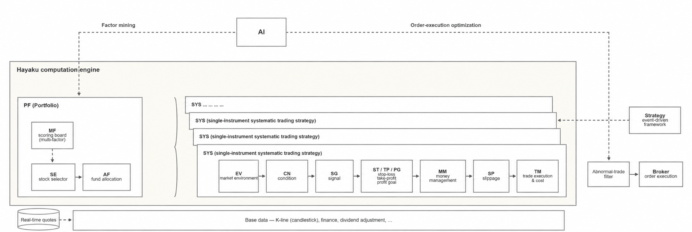

<p align="center">
  
</p>

<p align="center">
  An open-source, high-performance quantitative trading framework in C++/Python<br>
  focused on strategy analysis and backtesting<br>
  <strong>Trading model R&amp;D · Ultra-fast engine · Efficient backtesting</strong>
</p>

<p align="center">
  
  
  
  
</p>

<p align="center">
  <b>English</b> | <a href="readme.zh.md">简体中文</a>
</p>

Hikyuu Quant Framework builds on mature systematic trading and portfolio management concepts, with a core
focus on a fast research workflow for strategy (or asset) portfolios. It decomposes quantitative analysis
into independently replaceable **strategy parts** — market environment, signals, stop-loss / take-profit,
money management, profit goals, slippage, multi-factor models and fund allocation — which you can freely
combine into your own strategy library and validate through backtesting.

> ⚠️ **Disclaimer**: This project is an open-source financial technology research tool. It is intended
> for personal study, academic research and data analysis only. It does not constitute any investment
> advice or trading guidance, and it does not provide or embed any securities trading service. The
> framework only offers generic interface extension capability; users are advised to connect only to
> compliant trading terminals provided by licensed institutions. Any trading interface, extension or
> actual operation added or developed by the user is entirely at the user's own risk and legal
> responsibility. Connecting to illegal trading channels or using the framework for non-compliant
> trading scenarios is strictly prohibited.

---

## 📊 Key Metrics

<p align="center">
  <table>
    <tr>
      <td align="center" width="33%">
        <strong><code>⚡ 166ms</code></strong><br>
        <sub>Sum over 19.13 million K-line bars after warm-up (AMD 7950x)</sub>
      </td>
      <td align="center" width="33%">
        <strong><code>🧩 10+</code></strong><br>
        <sub>Core strategy parts · freely composable asset library</sub>
      </td>
      <td align="center" width="33%">
        <strong><code>💾 4 types</code></strong><br>
        <sub>Storage backends (HDF5 / MySQL / ClickHouse / SQLite)</sub>
      </td>
    </tr>
  </table>
</p>

---

## 🔗 Quick Links

| Item                         | Link                                                                                                                                          |
| ---------------------------- | --------------------------------------------------------------------------------------------------------------------------------------------- |
| 🏠 **Project home page**     | [https://hikyuu.org/](https://hikyuu.org/)                                                                                                     |
| 📚 **Documentation**         | [https://hikyuu-en.readthedocs.io/en/latest/](https://hikyuu-en.readthedocs.io/en/latest/)                                       |
| 🚀 **Getting started**       | [Jupyter Notebook tutorial series](https://nbviewer.org/github/fasiondog/hikyuu/blob/master/hikyuu/examples/notebook/en/000-Index.ipynb?flush_cache=True) |
| 🧰 **Strategy part library** | [https://gitee.com/fasiondog/hikyuu_hub](https://gitee.com/fasiondog/hikyuu_hub)                                                              |

---

## ⚡ Quick Start (run your first backtest)

### Requirements

- **Python 3.10+** (3.9 and below are no longer supported for pip installation since 2.8.0)
- Windows / Linux / macOS (Linux: Ubuntu 24.04+)
- Main dependencies are installed automatically: `numpy`, `pandas`, `matplotlib`, `PySide6`,
  `tables`, etc.

### Step 1: Install

```bash
pip install hikyuu
```

If the download is slow (for users in China), use a mirror:

```bash
pip install hikyuu -i https://pypi.tuna.tsinghua.edu.cn/simple
```

### Step 2: Import market data

Import historical A-share market data with either method:

```bash
# Graphical interface (recommended for first use; it generates the configuration file)
HikyuuTDX

# Command line (requires having run HikyuuTDX once to generate the configuration)
importdata
```

> ℹ️ **Data coverage**: HikyuuTDX downloads **China A-share** historical data only and needs a one-time initial configuration in the GUI. Overseas markets (US stocks, etc.) are not available yet and will be supported gradually.

### Step 3: Open an explicit research session

```python
from hikyuu import Query, open_session
from hikyuu.execution import AccountConfig

account = AccountConfig(initial_cash=300000, name="research")
with open_session(account_config=account) as session:
    session.wait_ready()
    bars = session.data.get_kdata("sz000001", Query(-150))
    snapshot = session.execution.snapshot()
    print(len(bars), snapshot.funds)
```

<p align="center">
  
</p>

> 📖 See the [Jupyter Notebook tutorial series](https://nbviewer.org/github/fasiondog/hikyuu/blob/master/hikyuu/examples/notebook/en/000-Index.ipynb?flush_cache=True)
> for the complete example.

### ❓ FAQ

| Symptom                                                     | Solution                                                                              |
| :---------------------------------------------------------- | :------------------------------------------------------------------------------------ |
| `pip install` on Windows hangs while downloading PyQt / PySide6 | Use the Tsinghua mirror: `pip install hikyuu -i https://pypi.tuna.tsinghua.edu.cn/simple` |
| `HikyuuTDX` GUI cannot import data                          | Use the `importdata` command instead (run the GUI once first to generate the config)   |
| Errors about a missing hdf5 / dll                           | Run `pip install tables` to reinstall HDF5 support                                    |
| Build tool for **building from source**                     | This project uses **xmake**, not cmake                                                |

> 💡 For more questions see the [documentation](https://hikyuu.readthedocs.io/en/latest/index.html),
> or [open an issue on Gitee](https://gitee.com/fasiondog/hikyuu/issues).

---

## 🚀 Why Hikyuu?

> Powerful features for your quantitative trading research

### 💹 Flexible composition: build a categorized strategy asset library

Hikyuu provides a lightweight abstraction over systematic trading methods, encapsulating the market
environment, signal generators, stop-loss / take-profit, money management, profit goals, slippage and
fund allocation as independently replaceable **strategy parts**. You can combine them freely, backtest
efficiently, and focus on the effect and impact of a single part during research. See
"Core parts of the systematic trading architecture" below for the complete list.

<p align="center">
  
</p>

### 🚀 Extreme performance: build your own quant application with ease

The project consists of three parts: a **high-performance C++ core library**, the **Python interface
layer (hikyuu)**, and the **interactive exploration tool**.

- **Measured on an AMD 7950x**: loading the full A-share market (19.13 million daily K-line bars) and
  computing and summing the 20-day moving average for the first time takes only **6 seconds**; once the
  data is warm, the same operation takes only **166 milliseconds**
  ([📊 Performance benchmark details](https://mp.weixin.qq.com/s?__biz=MzkwMzY1NzYxMA==&mid=2247483768&idx=1&sn=33e40aa9633857fa7b4c7ded51c95ae7),
  article in Chinese).
- **C++ core library**: ships with a complete strategy framework, native multi-threading and multi-core
  acceleration, leaving room to scale for very high computing demands. The core library can also be used
  standalone, helping developers build custom quantitative tools quickly.
- **Python interface layer (hikyuu)**: a lightweight wrapper around the C++ core with TA-Lib integrated;
  converts seamlessly to and from numpy and pandas, so it plugs into the mainstream Python data analysis
  ecosystem.
- **hikyuu.interactive**: the interactive exploration tool, with built-in visualization of candlesticks,
  indicators and signals, suitable for rapid strategy validation and backtest analysis.

### 🍳 Concise syntax: explore strategies faster and more freely

Both **object-oriented** and **command-line** styles are supported. Especially during strategy exploration,
the command-line style is minimal and expressive, letting you validate ideas and iterate faster.

### 🔐 Self-controlled: build your own cloud quant platform

Combining **Python + Jupyter** with a cloud server gives you a fully self-controlled cloud quant platform.
Once deployed, access it anywhere (phone, tablet or computer) and turn new ideas into practice quickly. It
also integrates with mature AI and data analysis tools such as **numpy, scipy, pandas and TensorFlow** for
building intelligent quantitative systems. You can customize the interface or deploy it as a service as
needed.

### 🎁 Modular and extensible data storage

Four storage backends are currently supported: **HDF5, MySQL, ClickHouse and SQLite**, with HDF5 as the
default (compact, fast to read and write, and easy to back up). ClickHouse is available through a plugin:
it reads and writes faster than HDF5 and uses far less space than MySQL, making it a better fit for
minute-level and higher-frequency data.

### 💻 Concise API design

A complete strategy backtest system takes only a few lines of code — the intuitive API makes strategy
development more efficient.

### 🔓 Open source and transparent, with data under your control

Released under the **Apache 2.0** license, with fully auditable source code. Core data and strategies stay
entirely under your local control; the C++ core library can be used standalone, so you can build your own
client tools without worrying about third-party platform restrictions.

---

## 🏗️ Core parts of the systematic trading architecture

> Rigorously architected around systematic trading concepts; every part can be replaced and combined freely

| Domain                  | Main API                                      | Responsibility                              |
| :---------------------- | :-------------------------------------------- | :------------------------------------------ |
| **Data**                | `open_session / DataEngine`                   | Explicit data lifetime and market queries   |
| **Execution**           | `AccountConfig / ExecutionEngine`            | Orders, cash, positions and trade history   |
|                         | `AccountSnapshot / AccountView`               | Immutable account inspection                |
| **Strategy**            | `StrategyDefinition / StrategyEngine`        | Component composition and orchestration     |
|                         | `BacktestRequest / BacktestResult`            | Stable backtest input and output values     |
| **Analysis**            | `hikyuu.analysis`                             | Explicit result conversion and analysis     |
| **Extensions**          | `hikyuu.spi / hikyuu.advanced`               | Custom protocols and low-level controls     |

---

## 📂 Browse the source

> A **Star ⭐** is welcome, as are contributions

| Platform        | Link                                                                      | Recommendation        |
| :-------------- | :------------------------------------------------------------------------ | :-------------------- |
| **GitHub**      | [https://github.com/fasiondog/hikyuu](https://github.com/fasiondog/hikyuu) | Overseas              |
| **Gitee**       | [https://gitee.com/fasiondog/hikyuu](https://gitee.com/fasiondog/hikyuu)   | ✅ Recommended in China |
| **GitCode**     | [https://gitcode.com/hikyuu/hikyuu](https://gitcode.com/hikyuu/hikyuu)     | ✅ Recommended in China |

---

## ❤️ Sponsorship

> 🙏 **Overseas sponsorship is being arranged.** International payment channels are not available yet. If you would like to support Hikyuu from overseas, please email **fasiondog@sina.com** and we will work out a way together.
>
> Supporters in China can use the Alipay / WeChat subscription plans listed in the [Chinese edition](readme.zh.md). Non-monetary support is equally welcome — see [How you can help](#-how-you-can-help) below.

---

## 🌟 How you can help

Community contributions are welcome:

- 🐛 Test and report bugs
- 📝 Write documentation
- 🔧 Develop new features
- 🎨 Improve the website

> 💡 **Please contribute by opening an issue on GitHub / Gitee / GitCode**

---

## 📦 Dependencies

The open-source projects directly depended on by the C++ core, together with their project URLs and
licenses, are summarized in [THIRD_PARTY_LICENSES.md](THIRD_PARTY_LICENSES.md) (indirect dependencies are
not listed). Thanks to all the open-source authors for their contributions 👍

Python-side dependencies are listed in [requirements.txt](requirements.txt).

---

## Star History

<a href="https://www.star-history.com/?repos=fasiondog%2Fhikyuu&type=date&legend=top-left">
 <picture>
   <source media="(prefers-color-scheme: dark)" srcset="https://api.star-history.com/chart?repos=fasiondog/hikyuu&type=date&theme=dark&legend=top-left" />
   <source media="(prefers-color-scheme: light)" srcset="https://api.star-history.com/chart?repos=fasiondog/hikyuu&type=date&legend=top-left" />
   
 </picture>
</a>
